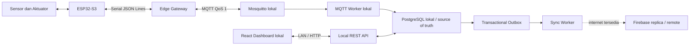
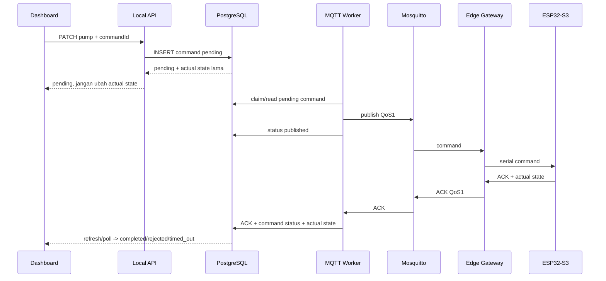

# Arsitektur SPFF

## Deployment boundaries

Safety-critical control loop, manual/automatic selector, watchdog, interlock, timeout pompa, RTC, dan fail-safe tetap berada di ESP32. Dashboard, Firebase, atau internet tidak menjadi dependency safety.

## Edge gateway

`edge-gateway` membaca satu JSON object per baris serial, memvalidasi dengan `@spff/contracts`, lalu menyimpan uplink ke durable disk outbox sebelum publish MQTT. Jika broker mati, proses serial dan queue lokal tetap tersedia. Record edge outbox dihapus setelah broker mengonfirmasi publish QoS 1.

Edge juga subscribe command khusus site/device, memvalidasi expiry, lalu meneruskan command ke ESP32. Command ID tetap harus diperlakukan idempotent oleh firmware.

## MQTT worker

`mqtt-worker` adalah proses lokal always-on yang:

- subscribe telemetry, ACK, dan status;
- memvalidasi topic identity dan contract;
- menyimpan ke PostgreSQL secara idempotent;
- mengubah command berdasarkan ACK aktual;
- membuat actual actuator state dari ACK ESP32;
- menandai command kedaluwarsa;
- membuat command dari schedule lokal;
- publish command `pending` dari PostgreSQL ke Mosquitto QoS 1.

Dengan desain ini API tidak menganggap MQTT publish sebagai bukti pompa berubah.

## Command lifecycle

## Cloud sync

Migration `003_transactional_outbox.sql` memasang trigger setelah perubahan domain penting. Event outbox tersimpan dalam transaksi PostgreSQL yang sama dengan data utama. `sync-worker` mengonsumsi outbox dengan locking, retry exponential, dead-letter, dan retention. Firestore write memakai version guard dari `outbox_id`, sehingga retry event lama tidak meregresikan materialized replica terbaru.

Firebase tidak pernah menjadi syarat dashboard lokal, command lokal, ingestion, atau datalog.

## Reliability boundaries yang belum bisa dibuktikan dari source saja

Durable edge outbox tidak menggantikan backlog firmware ESP32. Requirement bahwa ESP32 hanya menghapus backlog setelah ACK server membutuhkan protokol/firmware dan integration test dengan hardware asli. Hal yang sama berlaku untuk interlock dan max-runtime pompa.
