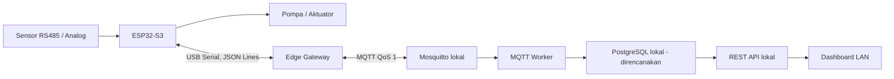

# Panduan Integrasi Hardware SPFF

**Target:** ESP32-S3, sensor/aktuator Smart Fertigasi, Orange Pi 4A, Edge Gateway, dan MQTT lokal
**Versi kontrak:** `spff/v1`, `schemaVersion: 1`  
**Status:** Draft integrasi berdasarkan implementasi repository per 31 Juli 2026

## 1. Tujuan dokumen

Dokumen ini menjadi acuan bersama tim hardware/firmware dan tim software untuk:

- Menghubungkan ESP32-S3 ke Orange Pi melalui serial.
- Mengirim semua pembacaan sensor dalam satu message telemetry.
- Menerima command pompa dan mengirim acknowledgement berdasarkan kondisi aktual.
- Melakukan commissioning tanpa melewati interlock atau fail-safe lokal.
- Menentukan bukti kelulusan sebelum hardware dianggap terintegrasi.

Dokumen ini tidak menggantikan schematic, datasheet, risk assessment kelistrikan, atau prosedur keselamatan mesin.

## 2. Kondisi implementasi saat ini

| Komponen                                 | Status kode         | Catatan |
| ---------------------------------------- | ------------------- | ------- |
| Serial JSON Lines di Edge Gateway        | Tersedia            | Membaca satu JSON object per baris, maksimum 16 KiB dan memvalidasi contract. |
| Telemetry/state/status/ACK ke MQTT       | Tersedia            | QoS 1; state/status terbaru retained, telemetry/ACK tidak retained. |
| Command DB -> MQTT -> serial             | Tersedia            | Worker memakai identity publisher terpisah, PUBACK broker sebelum menandai `published`, Edge menolak command kedaluwarsa. |
| PostgreSQL ingestion                     | Tersedia            | MQTT Worker menyimpan telemetry/state/status/ACK idempotent ke PostgreSQL. |
| REST API membaca PostgreSQL              | Tersedia            | Dashboard tidak lagi bergantung pada mock repository untuk runtime utama. |
| Edge disk outbox                         | Tersedia            | Uplink ditulis ke disk sebelum publish dan baru dihapus setelah MQTT publish sukses. |
| Payload `state`                          | Tersedia            | `actuator_state` membawa actual state dari ESP32 dan topic `/state` retained. |
| ESP32 backlog -> server DB receipt       | Perlu firmware/test | Edge PUBACK bukan bukti row sudah commit ke PostgreSQL. Firmware belum boleh menghapus backlog hanya karena serial write/MQTT PUBACK. |
| Auto-reopen serial setelah kabel dicabut | Tersedia di kode | Reconnect memakai exponential backoff; tetap wajib diuji dengan port target/USB nyata pada Orange Pi. |

## 3. Arsitektur dan batas tanggung jawab



### ESP32-S3 bertanggung jawab atas

- Membaca sensor dan melakukan filtering yang diperlukan.
- Menjaga identitas device, sequence, timestamp, dan backlog lokal.
- Menjalankan mode manual/otomatis, watchdog, interlock, dan fail-safe.
- Membatasi durasi aktif pompa dan menolak kondisi yang tidak aman.
- Menentukan actual state aktuator; dashboard bukan sumber actual state.
- Mengirim ACK command setelah command dinilai atau benar-benar dieksekusi.

### Edge Gateway bertanggung jawab atas

- Membuka satu serial port milik ESP32.
- Memisahkan frame berdasarkan newline.
- Memvalidasi bentuk payload dan `siteId/deviceId`.
- Menjembatani telemetry, ACK, dan status ke MQTT.
- Meneruskan command MQTT yang valid dan belum kedaluwarsa ke ESP32.
- Mengirim status offline saat koneksi serial/gateway tidak tersedia.

### ESP32 tidak melakukan

- Koneksi langsung ke REST API, PostgreSQL, atau Firebase.
- Koneksi MQTT langsung selama arsitektur Edge Gateway ini digunakan.
- Menganggap MQTT publish sebagai bukti pompa berhasil berubah.
- Menyerahkan kontrol keselamatan kepada dashboard atau koneksi internet.

## 4. Interface fisik dan kelistrikan

### 4.1 Metode koneksi yang direkomendasikan

Gunakan salah satu interface berikut, dengan preferensi urutan:

1. USB native/USB CDC dari board ESP32-S3 ke Orange Pi.
2. USB-to-UART adapter berkualitas dengan level logika 3,3 V.
3. Direct UART hanya setelah schematic dan proteksi kelistrikan disetujui.

Untuk direct UART TTL:

- Level logika harus 3,3 V.
- TX ESP32 terhubung ke RX Orange Pi/adapter.
- RX ESP32 terhubung ke TX Orange Pi/adapter.
- Ground harus memiliki referensi bersama.
- Jangan memasukkan sinyal TTL 5 V langsung ke ESP32-S3.
- Pin UART final harus mengikuti schematic board; dokumen ini tidak menentukan nomor GPIO.

Lengkapi tabel berikut sebelum wiring final:

| Signal         | ESP32-S3 pin | Orange Pi/adapter pin | Level         | Proteksi/isolasi | Status          |
| -------------- | ------------ | --------------------- | ------------- | ---------------- | --------------- |
| TX             | TBD          | TBD                   | 3,3 V         | TBD              | Belum disetujui |
| RX             | TBD          | TBD                   | 3,3 V         | TBD              | Belum disetujui |
| GND            | TBD          | TBD                   | 0 V reference | TBD              | Belum disetujui |
| USB power/VBUS | TBD          | TBD                   | Sesuai board  | TBD              | Belum disetujui |

### 4.2 Power dan noise

- Jangan menyuplai pompa, relay coil, atau solenoid dari regulator ESP32.
- Gunakan power supply aktuator terpisah dengan proteksi fuse yang sesuai.
- Gunakan flyback diode/snubber/driver yang sesuai jenis beban.
- Pertimbangkan opto-isolation atau galvanic isolation pada lingkungan noisy.
- Pisahkan routing kabel sensor/serial dari kabel motor dan switching power.
- Orange Pi produksi membutuhkan power supply stabil, pendingin aktif, dan UPS.
- Data server disimpan di NVMe, bukan microSD, setelah PostgreSQL tersedia.

Keputusan grounding, isolation, fuse rating, dan emergency stop harus disetujui engineer kelistrikan yang bertanggung jawab.

## 5. Parameter serial

| Parameter             | Nilai                           |
| --------------------- | ------------------------------- |
| Baud rate             | 115200 baud                     |
| Data bits             | 8                               |
| Parity                | None                            |
| Stop bits             | 1                               |
| Flow control          | None                            |
| Encoding              | UTF-8                           |
| Framing               | Satu JSON object diakhiri `\n`  |
| Line ending diterima  | `\n` atau `\r\n`                |
| Ukuran maksimum frame | 16384 byte, dapat dikonfigurasi |
| Duplex                | Dua arah                        |

Edge Gateway saat ini mengatur baud rate secara eksplisit dan menggunakan default library untuk 8-N-1/no flow control. Sebelum production, parameter selain baud rate sebaiknya dibuat eksplisit di kode agar tidak bergantung pada default library.

### 5.1 Aturan framing

- Satu baris hanya berisi satu JSON object lengkap.
- Jangan mengirim pretty-printed JSON multi-baris.
- Jangan mengirim prefix log seperti `INFO:` pada port protokol.
- Jangan memakai trailing comma, komentar JSON, `NaN`, atau `Infinity`.
- Gunakan titik sebagai decimal separator.
- Akhiri setiap message dengan newline, termasuk message terakhir.
- Log debug firmware sebaiknya memakai port berbeda. Jika hanya ada satu port, log non-JSON harus dinonaktifkan pada build integrasi.

Contoh yang valid di serial:

```json
{
  "kind": "telemetry",
  "schemaVersion": 1,
  "siteId": "greenhouse-01",
  "deviceId": "esp32-s3-01",
  "messageId": "01JXYZ123ABC",
  "sequence": 42,
  "recordedAt": "2026-07-31T12:00:00.000Z",
  "sensors": { "ph": 6.2, "ec": 1.5, "temperature": 27.4, "soilMoisture": 68 }
}
```

Karakter `\n` dikirim setelah karakter `}` dan tidak ditampilkan di contoh.

## 6. Identitas dan waktu

### 6.1 Identity

Default commissioning:

```text
siteId   = greenhouse-01
deviceId = esp32-s3-01
```

Aturan:

- Hanya gunakan huruf, angka, `_`, dan `-`.
- Nilai harus sama pada firmware, `edge-gateway/.env`, ACL broker, dan payload.
- Satu `deviceId` hanya mewakili satu controller fisik.
- Ganti controller harus dicatat; jangan diam-diam menggunakan sequence lama tanpa keputusan migrasi.

### 6.2 Timestamp

- Gunakan UTC ISO 8601, contoh `2026-07-31T12:00:00.000Z`.
- Jangan mengirim waktu lokal tanpa offset.
- RTC/NTP sync harus dilakukan sebelum timestamp dianggap valid.
- Jika waktu belum valid, firmware harus menandai kondisi tersebut pada diagnostik dan tidak membuat timestamp palsu.
- Dashboard bertanggung jawab mengubah UTC ke zona waktu tampilan.

### 6.3 Idempotency

- `messageId` harus unik untuk setiap sample telemetry.
- `sequence` harus integer dan bertambah monoton per device.
- Sequence dan counter command yang diperlukan harus bertahan melewati reboot jika digunakan untuk deduplikasi backlog.
- Command dengan `commandId` yang sama tidak boleh menyalakan/mematikan aktuator dua kali.

## 7. Daftar sensor dalam contract v1

Semua sensor dikirim melalui satu message telemetry. Tidak ada topic atau REST endpoint terpisah per sensor.

| Key JSON       | Arti                    | Unit yang disepakati | Wajib setiap message? |
| -------------- | ----------------------- | -------------------- | --------------------- |
| `ph`           | pH media/larutan        | Tanpa unit           | Tidak                 |
| `ec`           | Electrical conductivity | mS/cm                | Tidak                 |
| `temperature`  | Suhu                    | °C                   | Tidak                 |
| `soilMoisture` | Kelembapan tanah/media  | %                    | Tidak                 |
| `waterTank`    | Level tangki air        | %                    | Tidak                 |
| `nutrientTank` | Level tangki nutrisi    | %                    | Tidak                 |

Nilai sensor harus berupa angka finite. Sensor yang tidak tersedia boleh dihilangkan dari object `sensors`; jangan menggantinya dengan `0`, string `"offline"`, `null`, atau data palsu.

Tim hardware harus melengkapi mapping berikut:

| Key            | Part number | Interface/channel | Raw range | Engineering range | Calibration method | Sample interval |
| -------------- | ----------- | ----------------- | --------- | ----------------- | ------------------ | --------------- |
| `ph`           | TBD         | TBD               | TBD       | TBD               | TBD                | TBD             |
| `ec`           | TBD         | TBD               | TBD       | TBD               | TBD                | TBD             |
| `temperature`  | TBD         | TBD               | TBD       | TBD               | TBD                | TBD             |
| `soilMoisture` | TBD         | TBD               | TBD       | TBD               | TBD                | TBD             |
| `waterTank`    | TBD         | TBD               | TBD       | TBD               | TBD                | TBD             |
| `nutrientTank` | TBD         | TBD               | TBD       | TBD               | TBD                | TBD             |

## 8. Message dari ESP32 ke Edge Gateway

### 8.1 Telemetry

Semua pembacaan pada satu waktu dikirim dalam satu payload:

```json
{
  "kind": "telemetry",
  "schemaVersion": 1,
  "siteId": "greenhouse-01",
  "deviceId": "esp32-s3-01",
  "messageId": "01JXYZ123ABC",
  "sequence": 42,
  "recordedAt": "2026-07-31T12:00:00.000Z",
  "sensors": {
    "soil_1_moisture": 68,
    "soil_1_temp": 26.8,
    "soil_1_ec_us_cm": 1250,
    "soil_1_ph": 6.2,
    "liquid_ph": 6.1,
    "liquid_ec_us_cm": 1450,
    "air_temp": 27.4,
    "air_humidity": 72,
    "tank_water_level_pct": 78,
    "flow_water_lpm": 2.3,
    "battery_voltage": 12.6
  }
}
```

Catatan:

- Contoh dibuat multi-baris untuk dibaca manusia; serial tetap harus satu baris.
- Telemetry dipublish MQTT QoS 1 dan tidak retained.
- QoS 1 dapat menghasilkan duplikat. Consumer PostgreSQL melakukan deduplikasi idempotent menggunakan identity/message key yang tersedia; `messageId` harus unik dan `sequence` harus monoton per device sesuai aturan firmware.

### 8.2 Device status

Kirim setelah boot selesai dan setiap ada perubahan mode penting:

```json
{
  "kind": "device_status",
  "schemaVersion": 1,
  "siteId": "greenhouse-01",
  "deviceId": "esp32-s3-01",
  "recordedAt": "2026-07-31T12:00:00.000Z",
  "online": true,
  "mode": "automatic",
  "firmwareVersion": "1.0.0"
}
```

Nilai `mode` hanya:

- `manual`
- `automatic`

Status MQTT bersifat retained. Namun ESP32 tetap harus mengirim status aktual setelah boot; jangan hanya mengandalkan retained status lama.

### 8.3 Actual actuator state

ESP32 adalah otoritas actual state. Kirim state setelah boot, setelah perubahan manual/automatic, dan setelah output/feedback aktuator berubah:

```json
{
  "kind": "actuator_state",
  "schemaVersion": 1,
  "siteId": "greenhouse-01",
  "deviceId": "esp32-s3-01",
  "messageId": "state-01JXYZ456",
  "commandId": "cmd-01JXYZ789",
  "recordedAt": "2026-07-31T12:00:01.000Z",
  "targetId": "pump_water",
  "state": "active",
  "isActive": true,
  "reason": "scheduled"
}
```

Nilai `state`: `active`, `inactive`, `offline`, atau `fault`. Untuk `active`, `isActive` harus `true`; untuk `inactive`, harus `false`. Topic `/state` dipublish QoS 1 dan retained agar consumer yang baru reconnect memperoleh state terakhir, tetapi database tetap menyimpan histori event.

Gunakan `messageId` baru untuk setiap event. Kirim satu event setelah boot dan setiap actual state berubah, bukan pada setiap iterasi loop. Jika perubahan terjadi karena command backend, sertakan `commandId` yang sama; untuk tombol lokal, automation internal, interlock, atau fault, `commandId` boleh dihilangkan dan penyebab ditulis pada `reason`. Setiap event yang lolos validasi dicatat beserta `recordedAt` ESP dan `receivedAt` server, lalu muncul pada Datalog **Aktivitas Pompa**.

### 8.4 Command acknowledgement

ACK final setelah command berhasil:

```json
{
  "kind": "command_ack",
  "schemaVersion": 1,
  "siteId": "greenhouse-01",
  "deviceId": "esp32-s3-01",
  "commandId": "cmd-01JXYZ789",
  "acknowledgedAt": "2026-07-31T12:00:02.000Z",
  "status": "completed",
  "targetId": "pump-watering",
  "actualState": {
    "isActive": true
  }
}
```

ACK ketika ditolak oleh interlock:

```json
{
  "kind": "command_ack",
  "schemaVersion": 1,
  "siteId": "greenhouse-01",
  "deviceId": "esp32-s3-01",
  "commandId": "cmd-01JXYZ789",
  "acknowledgedAt": "2026-07-31T12:00:02.000Z",
  "status": "rejected",
  "targetId": "pump-watering",
  "actualState": {
    "isActive": false
  },
  "reason": "water_tank_low"
}
```

Status ACK yang tersedia:

| Status      | Kapan digunakan                                                          |
| ----------- | ------------------------------------------------------------------------ |
| `accepted`  | Command valid dan masuk proses, tetapi actual state belum tercapai.      |
| `completed` | Actual state sudah diverifikasi sesuai permintaan.                       |
| `rejected`  | Command tidak aman, target tidak dikenal, mode tidak sesuai, atau gagal. |
| `timed_out` | Eksekusi dimulai tetapi tidak selesai dalam batas waktu firmware.        |

## 9. Message dari Edge Gateway ke ESP32

### 9.1 Command pompa

Edge mengirim JSON Lines berikut ke serial:

```json
{
  "kind": "command",
  "schemaVersion": 1,
  "siteId": "greenhouse-01",
  "deviceId": "esp32-s3-01",
  "commandId": "cmd-01JXYZ789",
  "issuedAt": "2026-07-31T12:00:00.000Z",
  "expiresAt": "2026-07-31T12:00:30.000Z",
  "requestedBy": "operator@example.com",
  "type": "set_pump",
  "targetId": "pump-watering",
  "params": {
    "isActive": true
  }
}
```

Firmware wajib menjalankan urutan:

1. Parse satu baris JSON lengkap.
2. Validasi `schemaVersion`, identity, type, target, dan parameter.
3. Tolak command yang duplicate berdasarkan `commandId`, atau kirim ulang hasil final yang sudah disimpan.
4. Periksa selector manual/automatic, interlock, level tangki, timeout, dan fault.
5. Jika proses memerlukan waktu, kirim `accepted`.
6. Operasikan output hanya jika semua kondisi aman.
7. Baca/konfirmasi actual state.
8. Kirim `completed`, `rejected`, atau `timed_out` dengan `actualState` dan reason jika relevan.

Edge menolak command dengan `expiresAt` invalid atau sudah lewat. Command tersebut tidak akan sampai ke ESP32.

### 9.2 Mapping aktuator

Mapping final harus disetujui kedua tim:

| `targetId`         | Aktuator fisik | Output/driver | Feedback actual state | Interlock | Max runtime |
| ------------------ | -------------- | ------------- | --------------------- | --------- | ----------- |
| `pump-watering`    | TBD            | TBD           | TBD                   | TBD       | TBD         |
| `pump-nutrient`    | TBD            | TBD           | TBD                   | TBD       | TBD         |
| `pump-nutrient-mc` | TBD            | TBD           | TBD                   | TBD       | TBD         |

Jangan mengandalkan nama display dashboard sebagai identifier firmware. Gunakan `targetId` stabil.

## 10. Mapping MQTT untuk referensi

ESP32 tidak perlu mengimplementasikan MQTT, tetapi tim hardware perlu memahami tujuan message setelah melewati Edge.

| Fungsi        | Topic                                   | QoS | Retained         | Arah Edge |
| ------------- | --------------------------------------- | --- | ---------------- | --------- |
| Telemetry     | `spff/v1/{siteId}/{deviceId}/telemetry` | 1   | Tidak            | Publish   |
| State         | `spff/v1/{siteId}/{deviceId}/state`     | 1   | Ya               | Publish   |
| Command       | `spff/v1/{siteId}/{deviceId}/commands`  | 1   | Tidak            | Subscribe |
| Command ACK   | `spff/v1/{siteId}/{deviceId}/ack`       | 1   | Tidak            | Publish   |
| Device status | `spff/v1/{siteId}/{deviceId}/status`    | 1   | Ya               | Publish   |

## 11. Urutan startup yang disarankan

### Firmware

1. Set semua output aktuator ke safe state.
2. Inisialisasi watchdog, selector, interlock, dan driver.
3. Inisialisasi sensor dan validasi calibration data.
4. Inisialisasi RTC/time source dan backlog storage.
5. Buka serial 115200 8-N-1.
6. Kirim `device_status` setelah initialization selesai.
7. Mulai telemetry periodik.
8. Proses command tanpa memblokir safety loop.

### Orange Pi

1. Start Mosquitto lokal.
2. Pastikan broker sehat.
3. Start MQTT Worker.
4. Start Edge Gateway.
5. Edge membuka serial dan status berubah online jika port tersedia.

## 12. Prosedur commissioning

### 12.1 Persiapan aman

- Lepaskan atau isolasi power aktuator selama test komunikasi awal.
- Pastikan emergency stop/interlock dapat diuji tanpa bahaya.
- Pastikan pump target tidak terhubung ke beban proses saat command test pertama.
- Catat firmware build hash/version, board serial number, `siteId`, dan `deviceId`.
- Pastikan hanya satu proses membuka serial port.

### 12.2 Test serial standalone

Hentikan Edge Gateway, lalu cari port stabil:

```bash
ls -l /dev/serial/by-id/
```

Konfigurasi dan baca port selama 10 detik:

```bash
SERIAL_DEVICE=/dev/serial/by-id/REPLACE_WITH_DEVICE
stty -F "$SERIAL_DEVICE" 115200 cs8 -cstopb -parenb -ixon -ixoff -crtscts
timeout 10 cat "$SERIAL_DEVICE"
```

Pass jika:

- Setiap baris dapat diparse sebagai JSON.
- Tidak ada log text non-JSON.
- Identity benar.
- Sequence naik.
- Timestamp UTC masuk akal.
- Sensor tidak menghasilkan `null`, `NaN`, atau nilai palsu saat disconnected.

### 12.3 Test broker tanpa hardware live

Dengan Edge Gateway berhenti atau `SERIAL_ENABLED=false`:

```bash
npm run mqtt:up
npm run mqtt:smoke
```

> **Peringatan:** smoke test memublikasikan command `set_pump`. Jangan menjalankannya ketika Edge aktif dengan serial dan aktuator live.

### 12.4 Test ESP32 sampai MQTT Worker

Atur `edge-gateway/.env`:

```env
SITE_ID=greenhouse-01
DEVICE_ID=esp32-s3-01
SERIAL_ENABLED=true
SERIAL_PORT=/dev/serial/by-id/REPLACE_WITH_DEVICE
SERIAL_BAUD_RATE=115200
SERIAL_MAX_LINE_BYTES=16384
```

Jalankan pada terminal terpisah:

```bash
npm run mqtt:up
npm run dev:mqtt-worker
npm run dev:edge
```

Pass telemetry jika row benar-benar masuk PostgreSQL, misalnya:

```sql
SELECT site_id, device_id, message_id, sequence, recorded_at
FROM spff.telemetry_samples
ORDER BY received_at DESC
LIMIT 5;
```

Lanjutkan dengan mencabut koneksi broker sementara, kirim beberapa message serial, pastikan file tetap berada di Edge outbox, lalu hidupkan broker dan verifikasi row masuk tanpa duplikat. MQTT PUBACK/Edge outbox tetap bukan receipt end-to-end untuk backlog firmware ESP32; mekanisme ACK setelah commit server harus diuji terpisah sebelum firmware menghapus backlog lokal.

### 12.5 Test command aktuator

Command test hanya dilakukan setelah:

- Wiring dan interlock disetujui.
- Beban berada pada kondisi aman.
- Ada observer di hardware dan software.
- Software team menyediakan publisher command terkontrol.
- Command memiliki expiry pendek dan target test yang jelas.

Jangan memakai `npm run mqtt:smoke` sebagai alat commissioning aktuator. API command publisher production belum tersedia pada repository ini.

Urutan bukti yang harus terlihat:

1. Command diterima Edge.
2. JSON command muncul di serial ESP32.
3. ESP32 mengirim ACK `accepted` jika proses asynchronous.
4. Output berubah hanya setelah interlock lolos.
5. Feedback/actual state dibaca.
6. ESP32 mengirim ACK final.
7. MQTT Worker menerima ACK dengan `commandId` yang sama.

### 12.6 Failure tests wajib

| Test                            | Expected behavior                                                                                                                 |
| ------------------------------- | --------------------------------------------------------------------------------------------------------------------------------- |
| Internet WAN dicabut            | Kontrol lokal, MQTT lokal, dan telemetry lokal tetap berjalan.                                                                    |
| Kabel serial dicabut            | Status menjadi offline; Edge tidak meneruskan command ke hardware. Restart Edge setelah kabel kembali pada implementasi saat ini. |
| Broker dihentikan               | ESP32 safety loop tetap berjalan; durability telemetry end-to-end belum dijamin sampai outbox selesai.                            |
| Command kedaluwarsa             | Edge menolak dan mengirim ACK `timed_out`; ESP32 tidak menerima command.                                                          |
| `commandId` duplicate           | Aktuator tidak dieksekusi dua kali; hasil final lama dikirim ulang.                                                               |
| Selector manual aktif           | Remote command ditolak sesuai safety policy dan actual state dilaporkan.                                                          |
| Sensor disconnected             | Jangan menghasilkan data normal palsu; status diagnostik/fault lokal harus aktif.                                                 |
| Tank level/interlock tidak aman | Command pompa ditolak dan reason code dikirim.                                                                                    |
| ESP32 reboot                    | Output kembali ke safe state, status boot dikirim, sequence/backlog ditangani sesuai keputusan persistence.                       |

## 13. Acceptance checklist

### Electrical dan safety

- [ ] Schematic dan pinout ditandatangani.
- [ ] Level UART/USB sesuai dan tidak ada 5 V TTL ke ESP32.
- [ ] Grounding/isolation disetujui.
- [ ] Driver, fuse, flyback/snubber sesuai beban.
- [ ] Power-on default seluruh aktuator aman.
- [ ] Watchdog, emergency stop, selector, interlock, dan maximum runtime diuji.

### Serial protocol

- [ ] 115200 8-N-1 stabil minimal 1 jam.
- [ ] Satu JSON object per baris tanpa log campuran.
- [ ] Frame maksimum tidak melebihi 16 KiB.
- [ ] Identity sama dengan konfigurasi Edge.
- [ ] Timestamp UTC valid.
- [ ] `messageId` unik dan sequence monoton.
- [ ] Semua sensor memakai key dan unit yang disepakati.

### Telemetry

- [ ] Telemetry valid terlihat di MQTT Worker.
- [ ] Missing sensor tidak diganti nilai palsu.
- [ ] Reboot behavior tercatat.
- [ ] Duplicate message dapat diidentifikasi.
- [ ] Gap data terlihat sebagai gap/offline, bukan data sintetis.

### Command

- [ ] Semua `targetId` memiliki mapping fisik.
- [ ] Command duplicate idempotent.
- [ ] Expired command tidak dieksekusi.
- [ ] Manual mode/interlock menolak remote command.
- [ ] ACK final memuat actual state.
- [ ] Reason code penolakan konsisten.

### Reliability

- [ ] WAN outage tidak menghentikan kontrol lokal.
- [ ] Serial disconnect menghasilkan offline.
- [ ] Broker restart dan Edge restart diuji.
- [ ] Telemetry receipt/backlog protocol sudah disepakati sebelum klaim offline durability.
- [ ] PostgreSQL persistence diuji sebelum klaim data tersimpan.

## 14. Troubleshooting

### Edge menampilkan `Unsupported serial payload`

Periksa:

- JSON valid dan hanya satu object per baris.
- `kind` sesuai contract.
- `schemaVersion` bernilai number `1`, bukan string `"1"`.
- `siteId/deviceId` sama persis dengan `.env`.
- Sensor value berupa number.
- Tidak ada key sensor di luar daftar contract v1.

### Edge tidak menemukan serial port

Periksa:

```bash
ls -l /dev/serial/by-id/
id spff
```

User service harus berada dalam grup `dialout`. Setelah menambah grup, logout/login atau restart service/session.

### Port busy

Hanya satu proses boleh membuka port. Hentikan `cat`, serial monitor IDE, atau Edge instance lain sebelum start service.

### Telemetry tidak muncul di worker

Urutkan pemeriksaan:

1. JSON terlihat di serial standalone.
2. Edge log menunjukkan serial connected.
3. Identity payload cocok.
4. Mosquitto sehat.
5. Worker memakai credential dan broker URL yang benar.
6. ACL topic sesuai `siteId/deviceId`.

### Command diterima tetapi pompa tidak berubah

Periksa ACK dan `reason`; jangan langsung mencoba bypass interlock. Pastikan target ID, mode selector, tank level, fault input, driver output, feedback input, dan timeout firmware.

## 15. Data handoff yang wajib diberikan tim hardware

| Item                               | Nilai                     |
| ---------------------------------- | ------------------------- |
| Board revision                     | TBD                       |
| ESP32 serial number                | TBD                       |
| Firmware version/build hash        | TBD                       |
| `siteId`                           | `greenhouse-01` sementara |
| `deviceId`                         | `esp32-s3-01` sementara   |
| Stable serial path                 | TBD                       |
| Pinout/schematic revision          | TBD                       |
| Sensor mapping dan unit            | TBD                       |
| Calibration procedure/version      | TBD                       |
| Pump `targetId` mapping            | TBD                       |
| Interlock matrix                   | TBD                       |
| Maximum runtime per pump           | TBD                       |
| Telemetry interval                 | TBD                       |
| Backlog capacity                   | TBD                       |
| Reboot/sequence persistence policy | TBD                       |

## 16. Keputusan protocol yang masih dibutuhkan

Sebelum release production, kedua tim harus menyepakati:

1. Telemetry storage receipt dari server ke ESP32 agar backlog hanya dihapus setelah benar-benar tersimpan.
2. Error/reason code resmi untuk sensor, interlock, driver, dan timeout.
3. Payload `state` aktual untuk seluruh aktuator dan selector.
4. Interval telemetry normal, burst, dan heartbeat.
5. Sequence persistence serta behavior setelah factory reset/controller replacement.
6. Batas dan format backlog microSD/flash.
7. Strategi auto-reconnect serial setelah unplug/replug.
8. Mapping pin, sensor, pump, feedback, dan interlock final.

Perubahan schema harus memperbarui `@spff/contracts`, validator, Edge, Worker, firmware, test, dan dokumentasi secara bersamaan.

## 17. Referensi repository

- Shared contract: `packages/contracts/src/index.ts`
- Edge serial adapter: `edge-gateway/src/serialGateway.ts`
- Edge serial/MQTT orchestration: `edge-gateway/src/index.ts`
- MQTT broker setup: `infrastructure/mqtt/compose.yml`
- MQTT operator runbook: `infrastructure/mqtt/README.md`
- System architecture: `docs/architecture.md`
